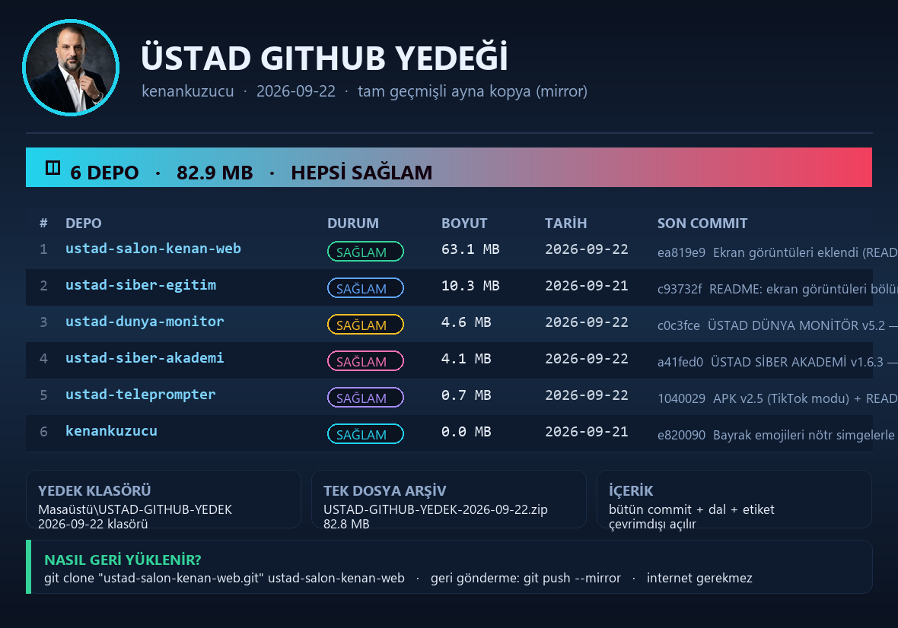

# ÜSTAD TELEPROMPTER

Konuşma metnini ekranda kaydırarak okutan teleprompter. **Türkçe**, tam **çevrimdışı** çalışır,
telefona/web'e uygulama gibi kurulabilir.

**Canlı adres:** https://kenankuzucu.github.io/ustad-teleprompter/

## Neler var
- Metin kutusu, adlı kayıtlar, örnek metin, otomatik hafıza
- Tam ekran okuma sahnesi: okuma çizgisi, üst/alt karartma, ayna, kılavuz, 15 tema, 6 gömülü yazı tipi
- Biçim işaretleri: `**kalın**`, `*eğik*`, `==işaretli==`, `[DUR]`, `[YAVAŞ]`, `[HIZLI]`, `[NORMAL]`
- Süre tahmini, süreye göre hız, kaldığın yeri kaydetme, ezber modu, üst durum şeridi
- Kamera + kayıt: **MP4 (H.264 + AAC)** ya da WebM, sesli/sessiz, yeşil perde, kamera yerleşimi
- Kaydı bilgisayarda klasör seçerek kaydetme; telefonda doğrudan Filmler klasörüne yazma (APK)
- **TikTok modu:** 720p/1080p/4K kalite, 16:9 · 9:16 · 1:1 · 4:5 çerçeve, 24/30/60 fps,
  10 filtre (canlı, sıcak, siyah-beyaz, vintage, sinematik…), yeşil perdeyi silme (düz renk / yeşil ekran / kendi fotoğrafın), zoom, ekran çözünürlüğü göstergesi
- Telefondan kumanda (bilgisayarda yerel sunucu açıkken)

## Telefona kurulum
- **Android:** [ustad-teleprompter-v2.6.apk](ustad-teleprompter-v2.6.apk) dosyasını indir ve kur (WebView tabanlı, çevrimdışı).
- **iPhone/iPad:** Safari ile canlı adresi aç → **Paylaş → Ana Ekrana Ekle**. Uygulama simgesiyle açılır, çevrimdışı çalışır.

## Dürüst notlar
- iPhone'da sesli kumanda ve konuşma takipli kaydırma çalışmaz (Safari konuşma tanımayı desteklemez).
- Kayıt iPhone'da paylaş menüsüyle Videolar'a/Dosyalar'a kaydedilir.
